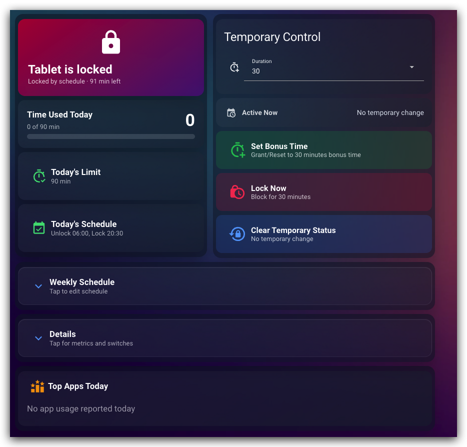
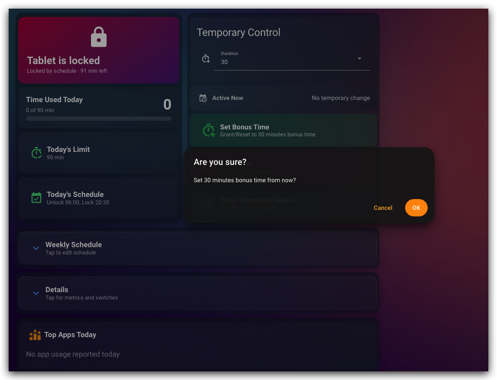
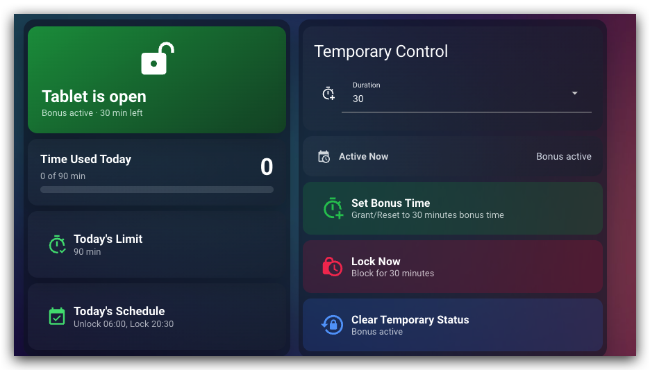
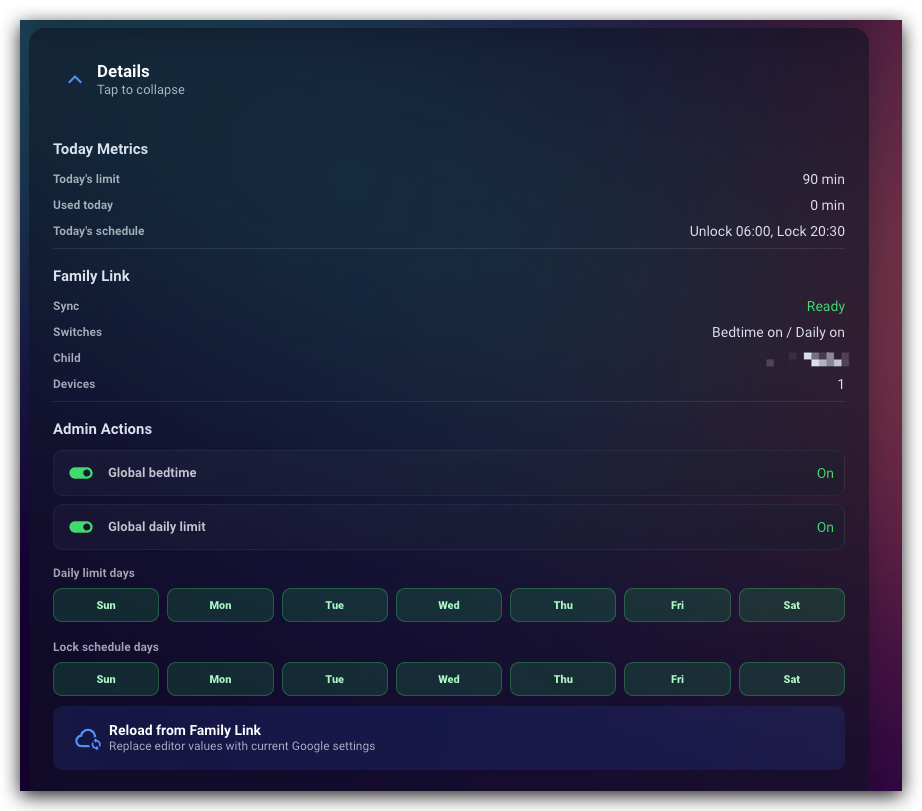
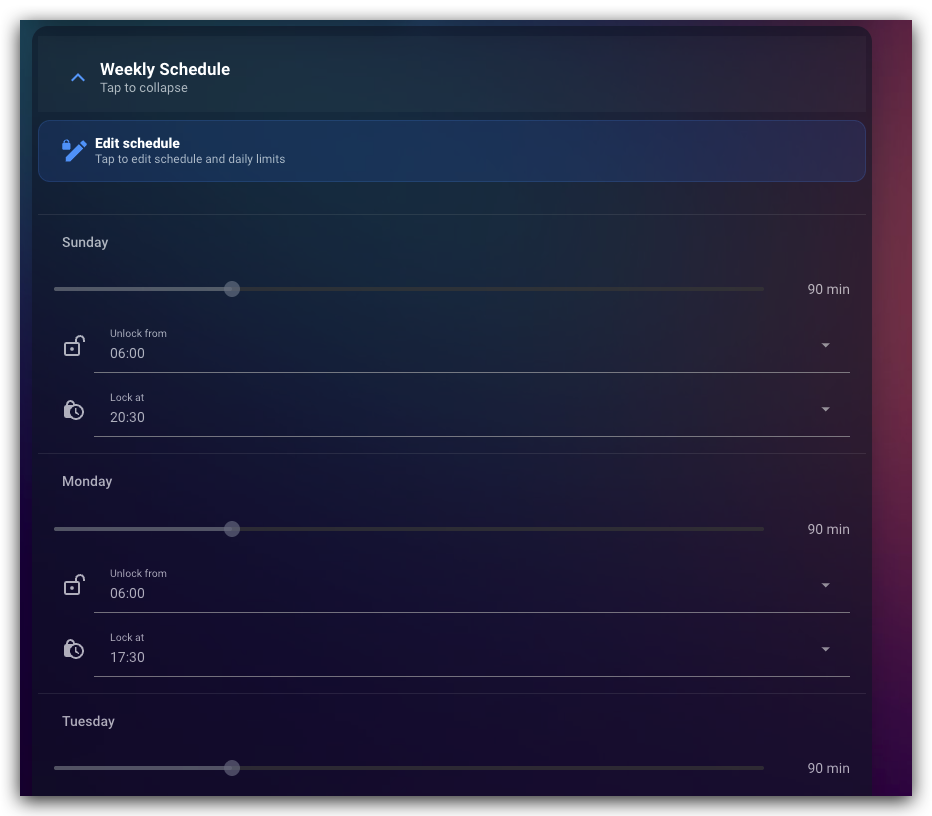
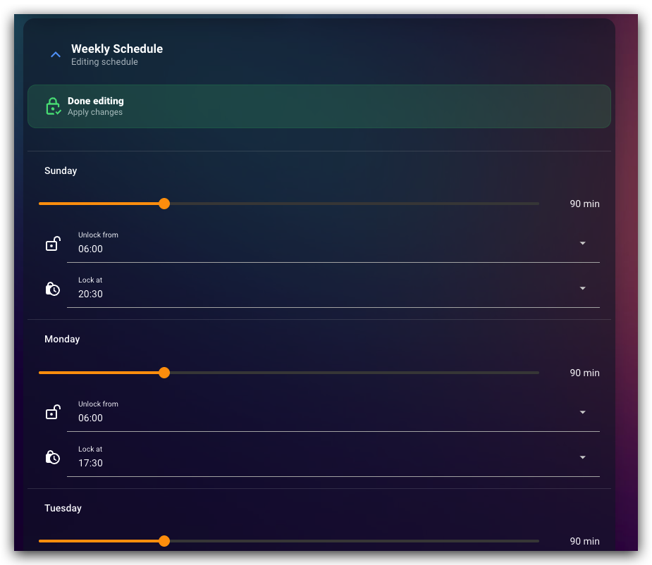

# Example Automations

Replace the entity IDs with the ones from your Home Assistant instance.

## Workflow Gallery

The dashboard shown here is not included with HAFamilyLink. It is a proof of concept built from this integration's entities and services.

A dashboard like this can put the main Family Link actions in one place: current lock state, bonus controls, weekly schedule editing, and detail toggles. The screenshots use demo-style labels and values.

| Main status | Actions and details |
| --- | --- |
|  |  |
|  |  |

| Weekly schedule | Edit mode |
| --- | --- |
|  |  |

## Extended Feature Examples

These examples focus on the extended controls in this fork: recurring bedtime schedules, recurring daily-limit schedules, today-only overrides, bonus time, app limits, and schedule readback.

Weekly school time schedule editing is not implemented. School time schedules are exposed for readback, and the existing school time toggle still applies today-only changes.

## Set School-Night Bedtime Schedule

Use `familylink.set_bedtime_schedule` to update the recurring weekly bedtime plan. This changes the schedule in Family Link; it is not just a Home Assistant timer.

```yaml
script:
  familylink_school_night_bedtime:
    alias: "Family Link: school-night bedtime"
    sequence:
      - repeat:
          for_each:
            - 1 # Monday
            - 2 # Tuesday
            - 3 # Wednesday
            - 4 # Thursday
          sequence:
            - service: familylink.set_bedtime_schedule
              data:
                entity_id: switch.child_tablet
                day: "{{ repeat.item }}"
                start_time: "20:30"
                end_time: "06:30"
                enabled: true
```

## Set Weekend Bedtime Schedule

```yaml
script:
  familylink_weekend_bedtime:
    alias: "Family Link: weekend bedtime"
    sequence:
      - service: familylink.set_bedtime_schedule
        data:
          entity_id: switch.child_tablet
          day: 5 # Friday
          start_time: "22:00"
          end_time: "09:00"
          enabled: true
      - service: familylink.set_bedtime_schedule
        data:
          entity_id: switch.child_tablet
          day: 6 # Saturday
          start_time: "22:00"
          end_time: "09:00"
          enabled: true
```

## Update The Weekly Daily Limit

Use `familylink.set_daily_limit_schedule` for recurring weekly limits. Use `familylink.set_daily_limit` when you only want a today override.

```yaml
script:
  familylink_weekday_daily_limit:
    alias: "Family Link: weekday daily limit"
    sequence:
      - repeat:
          for_each:
            - 1 # Monday
            - 2 # Tuesday
            - 3 # Wednesday
            - 4 # Thursday
            - 5 # Friday
          sequence:
            - service: familylink.set_daily_limit_schedule
              data:
                entity_id: switch.child_tablet
                day: "{{ repeat.item }}"
                daily_minutes: 90
                enabled: true
```

## Apply A Today-Only Daily Limit

This does not rewrite the weekly schedule. It applies a daily limit override for the selected device today.

```yaml
automation:
  - alias: "Family Link: shorter limit on school nights"
    trigger:
      - platform: time
        at: "18:30:00"
    condition:
      - condition: time
        weekday:
          - mon
          - tue
          - wed
          - thu
    action:
      - service: familylink.set_daily_limit
        data:
          entity_id: switch.child_tablet
          daily_minutes: 60
```

## Add Bonus Time From A Helper

```yaml
automation:
  - alias: "Family Link: bonus time after homework"
    trigger:
      - platform: state
        entity_id: input_boolean.homework_done
        to: "on"
    action:
      - service: familylink.add_time_bonus
        data:
          entity_id: switch.child_tablet
          bonus_minutes: 30
      - service: notify.mobile_app
        data:
          message: "Added 30 minutes of bonus time."
```

## Notify When Bedtime Is Overridden Today

Device switches expose whether today's effective bedtime comes from the weekly schedule or from a one-day override.

```yaml
automation:
  - alias: "Family Link: bedtime override active"
    trigger:
      - platform: state
        entity_id: switch.child_tablet
        attribute: bedtime_today_source
    condition:
      - condition: template
        value_template: >
          {{ state_attr('switch.child_tablet', 'bedtime_today_source') == 'today_override' }}
    action:
      - service: notify.mobile_app
        data:
          message: >
            Bedtime is using a today-only override:
            {{ state_attr('switch.child_tablet', 'bedtime_window_label') }}
```

## Set A Per-App Limit In The Evening

App-control services need Android package names. You can find them in the app-related sensor attributes or from the Google Play Store URL.

```yaml
automation:
  - alias: "Family Link: limit video app at night"
    trigger:
      - platform: time
        at: "20:00:00"
    action:
      - service: familylink.set_app_daily_limit
        data:
          entity_id: sensor.child_blocked_apps
          package_name: com.youtube.android
          minutes: 0

  - alias: "Family Link: restore video app limit in the morning"
    trigger:
      - platform: time
        at: "07:00:00"
    action:
      - service: familylink.set_app_daily_limit
        data:
          entity_id: sensor.child_blocked_apps
          package_name: com.youtube.android
          minutes: -1
```

## Refresh Location On Demand

Requires GPS location tracking. Each location poll may notify the child's device, so use this deliberately.

```yaml
script:
  familylink_refresh_child_location:
    alias: "Family Link: refresh child location"
    sequence:
      - service: familylink.refresh_location
        data:
          entity_id: device_tracker.child
```
